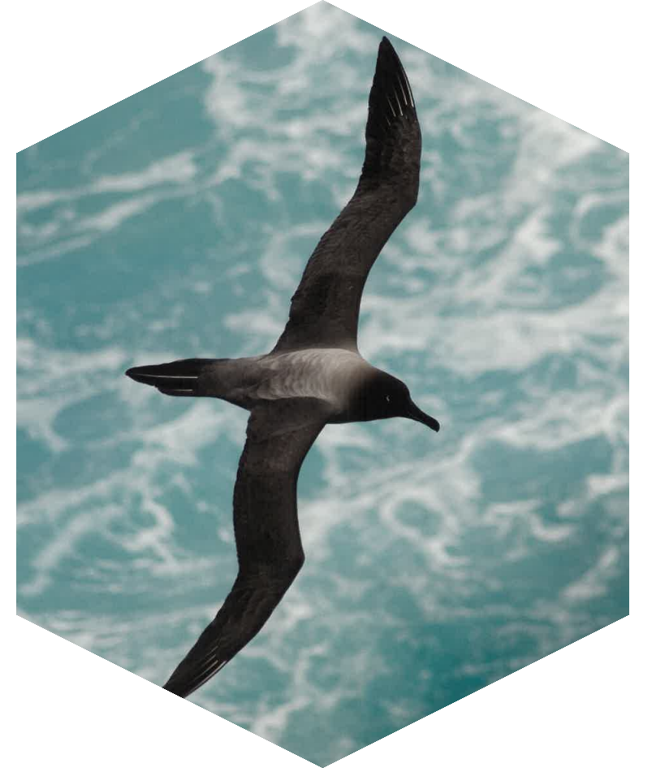

<!-- README.md is generated from README.Rmd. Please edit that file -->

```{r, include = FALSE}
knitr::opts_chunk$set(
  collapse = TRUE,
  comment = "#>",
  fig.path = "man/figures/README-",
  out.width = "100%"
)
```


# sooty  


<!-- badges: start -->
[](https://github.com/mdsumner/sooty/actions/workflows/R-CMD-check.yaml)
[](https://CRAN.R-project.org/package=sooty)
<!-- badges: end -->

The goal of sooty is to provide access to data of relevance to Southern Ocean research. 

To see what files we know about in object storage, use 

```{r sooty}
library(sooty)
(files <- tibble::as_tibble(sooty_files()))
```

These are all directly useable source identifiers that a GDAL-enabled package can read. (See examples below).  

For now we only have manual handling for dates, such as: 

```{r terra}
library(terra)
file <- files$source[which.max(files$date) ]
print(file)


rast(file)
```


The available datasets can be found from the table. 

```{r datasets}
dplyr::distinct(sooty_files(), Dataset)
```

There are data sets like the 25km resolution south polar stereographic sea ice concentration, available via the dataset identifier `: 

```{r south}
icefiles <- sooty_files() |> dplyr::filter(Dataset == "NSIDC_SEAICE_PS_S25km")
dplyr::glimpse(icefiles)
```

You can immediately see what range of dates is available: 


```{r oldest}
range(icefiles$date)
```

And, explore exactly what source files are available: 

```{r files}

range(diff(icefiles$date))  ## there are some gaps, it's every two days to start and some are missing

diff(range(icefiles$date))  ## the number of potential data days

nrow(icefiles)  ## the actual number of data days
```

This is a very experimental begin at replacing [raadtools](https://github.com/AustralianAntarcticDivision/raadtools) with a package anyone can use. 


We can read from the datasets with a GDAL-ready package, such as terra. But note that we need to set a configuration first, and we need to unset it after,  this is WIP. 

```{r}
amsrfiles <- dataset("antarctica-amsr2-asi-s3125-tif")@source
library(terra)

(r <- rast(tail(amsrfiles$source, 1)))
r[r > 100] <- NA
plot(r[[nlyr(r)]] * 1, main = format(max(icefiles$date)))
ghrsst <- dataset("ghrsst-tif")
sstfile <- ghrsst@source$source[match(max(icefiles$date), ghrsst@source$date)]
sst <- rast(sprintf("vrt://%s?ovr=4", sstfile))
ct <- as.contour(crop(sst, ext(-180, 180, -90, -40)))
plot(project(ct, crs(r)), add = TRUE, col = "hotpink")
```

That should be the state of the sea ice in the Southern Ocean at the latest available date, sea ice concentration from passive microwave at 3.125km resolution, by the AWI artist sea ice group. 


## S7 object control

We have an in-progress class for dataset handling. Create a 'dataset()' and set an id. 

```{r object}
ds <- dataset()
ds@id <- "NSIDC_SEAICE_PS_S25km"
ds

ds@source
```


## Code of Conduct
  
Please note that the idt project is released with a [Contributor Code of Conduct](https://contributor-covenant.org/version/2/1/CODE_OF_CONDUCT.html). By contributing to this project, you agree to abide by its terms.

