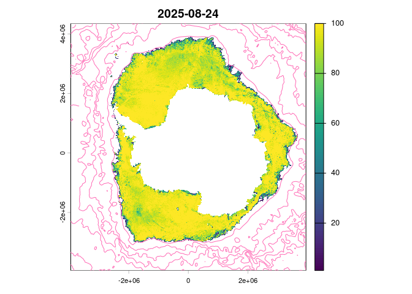

<!-- README.md is generated from README.Rmd. Please edit that file -->

# sooty 

<!-- badges: start -->

[](https://github.com/mdsumner/sooty/actions/workflows/R-CMD-check.yaml)
[](https://CRAN.R-project.org/package=sooty)
<!-- badges: end -->

The goal of sooty is to provide access to data of relevance to Southern
Ocean research.

To see what files we know about in object storage, use

``` r
library(sooty)
(files <- sooty_files())
#> # A tibble: 118,292 × 7
#>    date                source                Dataset Bucket Key   Protocol Host 
#>    <dttm>              <chr>                 <chr>   <chr>  <chr> <chr>    <chr>
#>  1 1981-09-01 00:00:00 /vsicurl/https://pro… oisst-… idea-… www.… /vsicurl http…
#>  2 1981-09-02 00:00:00 /vsicurl/https://pro… oisst-… idea-… www.… /vsicurl http…
#>  3 1981-09-03 00:00:00 /vsicurl/https://pro… oisst-… idea-… www.… /vsicurl http…
#>  4 1981-09-04 00:00:00 /vsicurl/https://pro… oisst-… idea-… www.… /vsicurl http…
#>  5 1981-09-05 00:00:00 /vsicurl/https://pro… oisst-… idea-… www.… /vsicurl http…
#>  6 1981-09-06 00:00:00 /vsicurl/https://pro… oisst-… idea-… www.… /vsicurl http…
#>  7 1981-09-07 00:00:00 /vsicurl/https://pro… oisst-… idea-… www.… /vsicurl http…
#>  8 1981-09-08 00:00:00 /vsicurl/https://pro… oisst-… idea-… www.… /vsicurl http…
#>  9 1981-09-09 00:00:00 /vsicurl/https://pro… oisst-… idea-… www.… /vsicurl http…
#> 10 1981-09-10 00:00:00 /vsicurl/https://pro… oisst-… idea-… www.… /vsicurl http…
#> # ℹ 118,282 more rows
```

The main columns of interest are `date` and `source` and `Dataset`, the
`source` is a directly useable source identifier that a GDAL-enabled
package can read. (See examples below).

We can get a very simple model of a “logical dataset” by honing in one
`Dataset` in particular. First let’s make a summary from everything:

``` r
library(sooty)
sooty_files() |> 
     dplyr::mutate(date = as.Date(date)) |>  dplyr::group_by(Dataset) |> 
     dplyr::summarize(earliest = min(date), latest = max(date), n = dplyr::n()) |> 
     dplyr::arrange(Dataset, earliest)
#> # A tibble: 14 × 4
#>    Dataset                              earliest   latest         n
#>    <chr>                                <date>     <date>     <int>
#>  1 BREMEN-SEAICE-SMOS-north             2010-05-01 2025-05-20  5474
#>  2 BREMEN-SEAICE-SMOS-south             2010-10-01 2016-05-03    12
#>  3 NSIDC_SEAICE_PS_N25km                1978-10-26 2025-05-20 17003
#>  4 NSIDC_SEAICE_PS_S25km                1978-10-26 2025-05-20 17003
#>  5 SEALEVEL_GLO_PHY_L4                  1993-01-01 2025-05-21 11715
#>  6 antarctica-amsr2-asi-s3125-tif       2012-07-02 2025-05-20  4695
#>  7 ccmp-wind-product-v2                 1993-01-02 2024-08-31 11552
#>  8 esacci-oc-l3s-chlor-a-merged-5day    1997-09-03 2025-03-27  2019
#>  9 esacci-oc-l3s-chlor-a-merged-annual  1997-05-22 2024-05-22    28
#> 10 esacci-oc-l3s-chlor-a-merged-daily   1997-09-04 2025-03-31 10045
#> 11 esacci-oc-l3s-chlor-a-merged-monthly 1997-09-01 2025-03-01   331
#> 12 ghrsst-tif                           2002-06-01 2025-05-20  8390
#> 13 oisst-avhrr-v02r01                   1981-09-01 2025-05-20 15968
#> 14 oisst-tif                            1981-09-01 2025-05-18 14057
```

``` r
library(terra)
#> terra 1.8.50
file <- files$source[which.max(files$date) ]
print(file)
#> [1] "/vsicurl/https://projects.pawsey.org.au/idea-sealevel-glo-phy-l4-nrt-008-046/data.marine.copernicus.eu/SEALEVEL_GLO_PHY_L4_NRT_008_046/cmems_obs-sl_glo_phy-ssh_nrt_allsat-l4-duacs-0.125deg_P1D_202411/2025/05/nrt_global_allsat_phy_l4_20250521_20250521.nc"


rast(file)
#> class       : SpatRaster 
#> dimensions  : 1440, 2880, 10  (nrow, ncol, nlyr)
#> resolution  : 0.125, 0.125  (x, y)
#> extent      : -180, 180, -90, 90  (xmin, xmax, ymin, ymax)
#> coord. ref. : +proj=longlat +a=6378136.3 +rf=298.257 +no_defs 
#> sources     : nrt_global_allsat_phy_l4_20250521_20250521.nc:sla  
#>               nrt_global_allsat_phy_l4_20250521_20250521.nc:err_sla  
#>               nrt_global_allsat_phy_l4_20250521_20250521.nc:ugosa  
#>               ... and 7 more sources
#> varnames    : sla (Sea level anomaly) 
#>               err_sla (Formal mapping error) 
#>               ugosa (Geostrophic velocity anomalies: zonal component) 
#>               ...
#> names       : sla, err_sla, ugosa, err_ugosa, vgosa, err_vgosa, ... 
#> unit        :   m,       m,   m/s,       m/s,   m/s,       m/s, ... 
#> time (days) : 2025-05-21
```

The available datasets can be found from the table.

``` r
dplyr::distinct(sooty_files(), Dataset)
#> # A tibble: 14 × 1
#>    Dataset                             
#>    <chr>                               
#>  1 oisst-avhrr-v02r01                  
#>  2 SEALEVEL_GLO_PHY_L4                 
#>  3 NSIDC_SEAICE_PS_S25km               
#>  4 NSIDC_SEAICE_PS_N25km               
#>  5 antarctica-amsr2-asi-s3125-tif      
#>  6 ghrsst-tif                          
#>  7 ccmp-wind-product-v2                
#>  8 BREMEN-SEAICE-SMOS-south            
#>  9 BREMEN-SEAICE-SMOS-north            
#> 10 oisst-tif                           
#> 11 esacci-oc-l3s-chlor-a-merged-monthly
#> 12 esacci-oc-l3s-chlor-a-merged-daily  
#> 13 esacci-oc-l3s-chlor-a-merged-5day   
#> 14 esacci-oc-l3s-chlor-a-merged-annual
```

There are data sets like the 25km resolution south polar stereographic
sea ice concentration, available via the dataset identifier \`:

``` r
icefiles <- sooty_files() |> dplyr::filter(Dataset == "NSIDC_SEAICE_PS_S25km")
dplyr::glimpse(icefiles)
#> Rows: 17,003
#> Columns: 7
#> $ date     <dttm> 1978-10-26, 1978-10-27, 1978-10-28, 1978-10-29, 1978-10-30, …
#> $ source   <chr> "/vsicurl/https://projects.pawsey.org.au/idea-10.5067-mpyg15w…
#> $ Dataset  <chr> "NSIDC_SEAICE_PS_S25km", "NSIDC_SEAICE_PS_S25km", "NSIDC_SEAI…
#> $ Bucket   <chr> "idea-10.5067-mpyg15waa4wx", "idea-10.5067-mpyg15waa4wx", "id…
#> $ Key      <chr> "n5eil01u.ecs.nsidc.org/PM/NSIDC-0051.002/1978.10.26/NSIDC005…
#> $ Protocol <chr> "/vsicurl", "/vsicurl", "/vsicurl", "/vsicurl", "/vsicurl", "…
#> $ Host     <chr> "https://projects.pawsey.org.au", "https://projects.pawsey.or…
```

You can immediately see what range of dates is available:

``` r
range(icefiles$date)
#> [1] "1978-10-26 UTC" "2025-05-20 UTC"
```

And, explore exactly what source files are available:

``` r

range(diff(icefiles$date))  ## there are some gaps, it's every two days to start and some are missing
#> Time differences in days
#> [1] 1 7

diff(range(icefiles$date))  ## the number of potential data days
#> Time difference of 17008 days

nrow(icefiles)  ## the actual number of data days
#> [1] 17003
```

This is a very experimental begin at replacing
[raadtools](https://github.com/AustralianAntarcticDivision/raadtools)
with a package anyone can use.

We can read from the datasets with a GDAL-ready package, such as terra.
But note that we need to set a configuration first, and we need to unset
it after, this is WIP.

``` r
amsrfiles <- dataset("antarctica-amsr2-asi-s3125-tif")@source
#> Warning in dataset("antarctica-amsr2-asi-s3125-tif"): 'dataset' is deprecated.
#> Use 'datasource' instead.
#> See help("Deprecated")
library(terra)

(r <- rast(tail(amsrfiles$source, 1)))
#> class       : SpatRaster 
#> dimensions  : 2656, 2528, 1  (nrow, ncol, nlyr)
#> resolution  : 3125, 3125  (x, y)
#> extent      : -3950000, 3950000, -3950000, 4350000  (xmin, xmax, ymin, ymax)
#> coord. ref. : WGS 84 / NSIDC Sea Ice Polar Stereographic South (EPSG:3976) 
#> source      : asi-AMSR2-s3125-20250520-v5.4.tif 
#> color table : 1 
#> name        : asi-AMSR2-s3125-20250520-v5.4
r[r > 100] <- NA
plot(r[[nlyr(r)]] * 1, main = format(max(icefiles$date)))
ghrsst <- dataset("ghrsst-tif")
#> Warning in dataset("ghrsst-tif"): 'dataset' is deprecated.
#> Use 'datasource' instead.
#> See help("Deprecated")
sstfile <- ghrsst@source$source[match(max(icefiles$date), ghrsst@source$date)]
sst <- rast(sprintf("vrt://%s?ovr=4", sstfile))
ct <- as.contour(crop(sst, ext(-180, 180, -90, -40)))
plot(project(ct, crs(r)), add = TRUE, col = "hotpink")
```



That should be the state of the sea ice in the Southern Ocean at the
latest available date, sea ice concentration from passive microwave at
3.125km resolution, by the AWI artist sea ice group.

## About the columns in `sooty_files()`

`Dataset` is the main grouping value, and files from different
`Dataset`s are otherwise non-relatable, be it by file format, available
variable/s, grid specification (spatial extent and resolution), or
temporal organization. We guarantee that within a Dataset, the files are
ordered and unique by date(-time) and that they are exactly relatable
spatially and (mostly, or usually also) by variable/s. The time series
may not be regular or complete, but usually is.

We retain the component parts of `source`, as `Bucket`, `Key`,
`Protocol`, and `Host` as this is object storage and these are the
separable parts of addressing objects in different ways, and we’ve
reserved that for future usage. (We use `https://` protocol by default
to avoid any required configurations). Get in touch if you have any
questions about this.

## S7 object control

We have an in-progress class for dataset handling. Create a ‘dataset()’
and set an id.

``` r
ds <- dataset()
#> Warning in dataset(): 'dataset' is deprecated.
#> Use 'datasource' instead.
#> See help("Deprecated")
ds@id <- "NSIDC_SEAICE_PS_S25km"
ds
#> <sooty::dataset>
#>  @ id     : chr "NSIDC_SEAICE_PS_S25km"
#>  @ n      : int 17003
#>  @ mindate: POSIXct[1:1], format: "1978-10-26"
#>  @ maxdate: POSIXct[1:1], format: "2025-05-20"
#>  @ source : tibble [17,003 × 7] (S3: tbl_df/tbl/data.frame)
#>  $ date    : POSIXct[1:17003], format: "1978-10-26" "1978-10-27" ...
#>  $ source  : chr [1:17003] "/vsicurl/https://projects.pawsey.org.au/idea-10.5067-mpyg15waa4wx/n5eil01u.ecs.nsidc.org/PM/NSIDC-0051.002/1978"| __truncated__ "/vsicurl/https://projects.pawsey.org.au/idea-10.5067-mpyg15waa4wx/n5eil01u.ecs.nsidc.org/PM/NSIDC-0051.002/1978"| __truncated__ "/vsicurl/https://projects.pawsey.org.au/idea-10.5067-mpyg15waa4wx/n5eil01u.ecs.nsidc.org/PM/NSIDC-0051.002/1978"| __truncated__ "/vsicurl/https://projects.pawsey.org.au/idea-10.5067-mpyg15waa4wx/n5eil01u.ecs.nsidc.org/PM/NSIDC-0051.002/1978"| __truncated__ ...
#>  $ Dataset : chr [1:17003] "NSIDC_SEAICE_PS_S25km" "NSIDC_SEAICE_PS_S25km" "NSIDC_SEAICE_PS_S25km" "NSIDC_SEAICE_PS_S25km" ...
#>  $ Bucket  : chr [1:17003] "idea-10.5067-mpyg15waa4wx" "idea-10.5067-mpyg15waa4wx" "idea-10.5067-mpyg15waa4wx" "idea-10.5067-mpyg15waa4wx" ...
#>  $ Key     : chr [1:17003] "n5eil01u.ecs.nsidc.org/PM/NSIDC-0051.002/1978.10.26/NSIDC0051_SEAICE_PS_S25km_19781026_v2.0.nc" "n5eil01u.ecs.nsidc.org/PM/NSIDC-0051.002/1978.10.27/NSIDC0051_SEAICE_PS_S25km_19781027_v2.0.nc" "n5eil01u.ecs.nsidc.org/PM/NSIDC-0051.002/1978.10.28/NSIDC0051_SEAICE_PS_S25km_19781028_v2.0.nc" "n5eil01u.ecs.nsidc.org/PM/NSIDC-0051.002/1978.10.29/NSIDC0051_SEAICE_PS_S25km_19781029_v2.0.nc" ...
#>  $ Protocol: chr [1:17003] "/vsicurl" "/vsicurl" "/vsicurl" "/vsicurl" ...
#>  $ Host    : chr [1:17003] "https://projects.pawsey.org.au" "https://projects.pawsey.org.au" "https://projects.pawsey.org.au" "https://projects.pawsey.org.au" ...

ds@source
#> # A tibble: 17,003 × 7
#>    date                source                Dataset Bucket Key   Protocol Host 
#>    <dttm>              <chr>                 <chr>   <chr>  <chr> <chr>    <chr>
#>  1 1978-10-26 00:00:00 /vsicurl/https://pro… NSIDC_… idea-… n5ei… /vsicurl http…
#>  2 1978-10-27 00:00:00 /vsicurl/https://pro… NSIDC_… idea-… n5ei… /vsicurl http…
#>  3 1978-10-28 00:00:00 /vsicurl/https://pro… NSIDC_… idea-… n5ei… /vsicurl http…
#>  4 1978-10-29 00:00:00 /vsicurl/https://pro… NSIDC_… idea-… n5ei… /vsicurl http…
#>  5 1978-10-30 00:00:00 /vsicurl/https://pro… NSIDC_… idea-… n5ei… /vsicurl http…
#>  6 1978-10-31 00:00:00 /vsicurl/https://pro… NSIDC_… idea-… n5ei… /vsicurl http…
#>  7 1978-11-01 00:00:00 /vsicurl/https://pro… NSIDC_… idea-… n5ei… /vsicurl http…
#>  8 1978-11-02 00:00:00 /vsicurl/https://pro… NSIDC_… idea-… n5ei… /vsicurl http…
#>  9 1978-11-03 00:00:00 /vsicurl/https://pro… NSIDC_… idea-… n5ei… /vsicurl http…
#> 10 1978-11-04 00:00:00 /vsicurl/https://pro… NSIDC_… idea-… n5ei… /vsicurl http…
#> # ℹ 16,993 more rows
```

## Code of Conduct

Please note that the idt project is released with a [Contributor Code of
Conduct](https://contributor-covenant.org/version/2/1/CODE_OF_CONDUCT.html).
By contributing to this project, you agree to abide by its terms.
