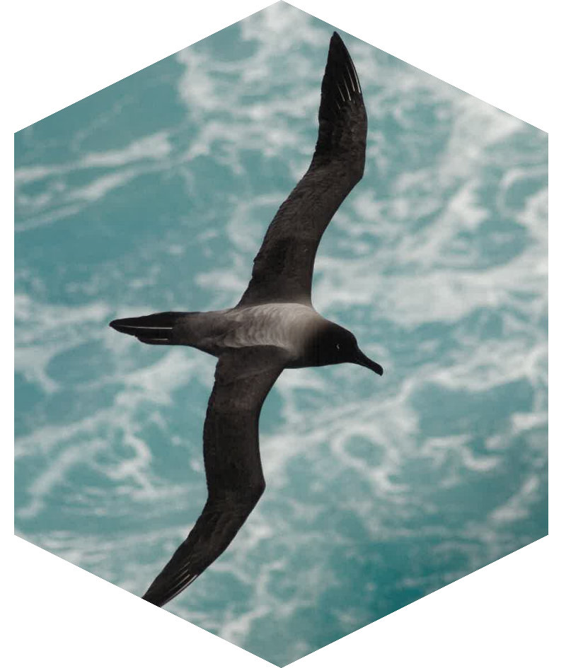

<!-- README.md is generated from README.Rmd. Please edit that file -->

# sooty 

<!-- badges: start -->

[](https://github.com/mdsumner/sooty/actions/workflows/R-CMD-check.yaml)
<!-- badges: end -->

The goal of sooty is to provide data of interest to Southern Ocean
research.

At the moment we only return lists of files available in object storage,
but future versions will provide direct access to the data in these
files with helper functions defined here.

To see what files we have in object storage, use

``` r
library(sooty)
(files <- tibble::as_tibble(sooty_files()))
#> # A tibble: 65,527 × 5
#>    date                source                              Bucket Key   protocol
#>    <dttm>              <chr>                               <chr>  <chr> <chr>   
#>  1 1981-09-01 00:00:00 /vsis3/idea-10.7289-v5sq8xb5/www.n… idea-… www.… /vsis3  
#>  2 1981-09-02 00:00:00 /vsis3/idea-10.7289-v5sq8xb5/www.n… idea-… www.… /vsis3  
#>  3 1981-09-03 00:00:00 /vsis3/idea-10.7289-v5sq8xb5/www.n… idea-… www.… /vsis3  
#>  4 1981-09-04 00:00:00 /vsis3/idea-10.7289-v5sq8xb5/www.n… idea-… www.… /vsis3  
#>  5 1981-09-05 00:00:00 /vsis3/idea-10.7289-v5sq8xb5/www.n… idea-… www.… /vsis3  
#>  6 1981-09-06 00:00:00 /vsis3/idea-10.7289-v5sq8xb5/www.n… idea-… www.… /vsis3  
#>  7 1981-09-07 00:00:00 /vsis3/idea-10.7289-v5sq8xb5/www.n… idea-… www.… /vsis3  
#>  8 1981-09-08 00:00:00 /vsis3/idea-10.7289-v5sq8xb5/www.n… idea-… www.… /vsis3  
#>  9 1981-09-09 00:00:00 /vsis3/idea-10.7289-v5sq8xb5/www.n… idea-… www.… /vsis3  
#> 10 1981-09-10 00:00:00 /vsis3/idea-10.7289-v5sq8xb5/www.n… idea-… www.… /vsis3  
#> # ℹ 65,517 more rows
```

These are all directly useable source identifiers that a GDAL-enabled
package can read.

In time we will provide helpers to pick specific data sets and open data
for a given date.

For now we only have manual handling, such as

``` r
library(terra)
#> terra 1.7.83
file <- files$source[which.max(files$date) ]
print(file)
#> [1] "/vsis3/idea-10.7289-v5sq8xb5/www.ncei.noaa.gov/data/sea-surface-temperature-optimum-interpolation/v2.1/access/avhrr/202411/oisst-avhrr-v02r01.20241130_preliminary.nc"

Sys.setenv(AWS_S3_ENDPOINT="projects.pawsey.org.au", 
           AWS_NO_SIGN_REQUEST="YES",
           GDAL_DISABLE_READDIR_ON_OPEN = "EMPTY_DIR")
rast(file)
#> class       : SpatRaster 
#> dimensions  : 720, 1440, 4  (nrow, ncol, nlyr)
#> resolution  : 0.25, 0.25  (x, y)
#> extent      : 0, 360, -90, 90  (xmin, xmax, ymin, ymax)
#> coord. ref. : lon/lat WGS 84 
#> sources     : oisst-avhrr-v02r01.20241130_preliminary.nc:sst  
#>               oisst-avhrr-v02r01.20241130_preliminary.nc:anom  
#>               oisst-avhrr-v02r01.20241130_preliminary.nc:err  
#>               oisst-avhrr-v02r01.20241130_preliminary.nc:ice  
#> varnames    : sst (Daily sea surface temperature) 
#>               anom (Daily sea surface temperature anomalies) 
#>               err (Estimated error standard deviation of analysed_sst) 
#>               ...
#> names       : sst_zlev=0, anom_zlev=0, err_zlev=0, ice_zlev=0 
#> unit        :    Celsius,     Celsius,    Celsius,          % 
#> time (days) : 2024-11-30
```

## Code of Conduct

Please note that the idt project is released with a [Contributor Code of
Conduct](https://contributor-covenant.org/version/2/1/CODE_OF_CONDUCT.html).
By contributing to this project, you agree to abide by its terms.
