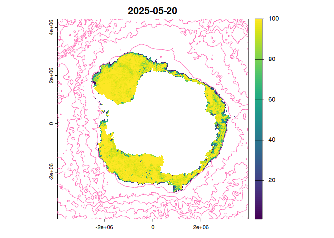

<!-- README.md is generated from README.Rmd. Please edit that file -->

# sooty 

<!-- badges: start -->

[](https://github.com/mdsumner/sooty/actions/workflows/R-CMD-check.yaml)
[](https://CRAN.R-project.org/package=sooty)
<!-- badges: end -->

The goal of sooty is to provide access to data of relevance to Southern
Ocean research.

To see what files we know about in object storage, use

``` r
library(sooty)
(files <- tibble::as_tibble(sooty_files()))
#> # A tibble: 85,189 × 6
#>    date                source                      Bucket Key   protocol Dataset
#>    <dttm>              <chr>                       <chr>  <chr> <chr>    <chr>  
#>  1 1981-09-01 00:00:00 /vsis3/idea-10.7289-v5sq8x… idea-… www.… /vsis3   oisst-…
#>  2 1981-09-02 00:00:00 /vsis3/idea-10.7289-v5sq8x… idea-… www.… /vsis3   oisst-…
#>  3 1981-09-03 00:00:00 /vsis3/idea-10.7289-v5sq8x… idea-… www.… /vsis3   oisst-…
#>  4 1981-09-04 00:00:00 /vsis3/idea-10.7289-v5sq8x… idea-… www.… /vsis3   oisst-…
#>  5 1981-09-05 00:00:00 /vsis3/idea-10.7289-v5sq8x… idea-… www.… /vsis3   oisst-…
#>  6 1981-09-06 00:00:00 /vsis3/idea-10.7289-v5sq8x… idea-… www.… /vsis3   oisst-…
#>  7 1981-09-07 00:00:00 /vsis3/idea-10.7289-v5sq8x… idea-… www.… /vsis3   oisst-…
#>  8 1981-09-08 00:00:00 /vsis3/idea-10.7289-v5sq8x… idea-… www.… /vsis3   oisst-…
#>  9 1981-09-09 00:00:00 /vsis3/idea-10.7289-v5sq8x… idea-… www.… /vsis3   oisst-…
#> 10 1981-09-10 00:00:00 /vsis3/idea-10.7289-v5sq8x… idea-… www.… /vsis3   oisst-…
#> # ℹ 85,179 more rows
```

These are all directly useable source identifiers that a GDAL-enabled
package can read, within caveats: note that there are environment
variables required to ensure the sources work. (See examples below).

For now we only have manual handling, such as

``` r
library(terra)
#> terra 1.7.83
file <- files$source[which.max(files$date) ]
print(file)
#> [1] "/vsis3/idea-sealevel-glo-phy-l4-nrt-008-046/data.marine.copernicus.eu/SEALEVEL_GLO_PHY_L4_NRT_008_046/cmems_obs-sl_glo_phy-ssh_nrt_allsat-l4-duacs-0.125deg_P1D_202411/2025/02/nrt_global_allsat_phy_l4_20250211_20250211.nc"

Sys.setenv(AWS_S3_ENDPOINT="projects.pawsey.org.au", 
           AWS_NO_SIGN_REQUEST="YES",
           GDAL_DISABLE_READDIR_ON_OPEN = "EMPTY_DIR")
rast(file)
#> class       : SpatRaster 
#> dimensions  : 1440, 2880, 10  (nrow, ncol, nlyr)
#> resolution  : 0.125, 0.125  (x, y)
#> extent      : -180, 180, -90, 90  (xmin, xmax, ymin, ymax)
#> coord. ref. : +proj=longlat +a=6378136.3 +rf=298.257 +no_defs 
#> sources     : nrt_global_allsat_phy_l4_20250211_20250211.nc:sla  
#>               nrt_global_allsat_phy_l4_20250211_20250211.nc:err_sla  
#>               nrt_global_allsat_phy_l4_20250211_20250211.nc:ugosa  
#>               ... and 7 more source(s)
#> varnames    : sla (Sea level anomaly) 
#>               err_sla (Formal mapping error) 
#>               ugosa (Geostrophic velocity anomalies: zonal component) 
#>               ...
#> names       : sla, err_sla, ugosa, err_ugosa, vgosa, err_vgosa, ... 
#> unit        :   m,       m,   m/s,       m/s,   m/s,       m/s, ... 
#> time (days) : 2025-02-11
```

The available datasets can be found from the table.

``` r
dplyr::distinct(sooty_files(), Dataset)
#> # A tibble: 7 × 1
#>   Dataset                       
#>   <chr>                         
#> 1 oisst-avhrr-v02r01            
#> 2 SEALEVEL_GLO_PHY_L4           
#> 3 NSIDC_SEAICE_PS_S25km         
#> 4 NSIDC_SEAICE_PS_N25km         
#> 5 antarctica-amsr2-asi-s3125-tif
#> 6 ghrsst-tif                    
#> 7 oisst-tif
```

There are data sets like the 25km resolution south polar stereographic
sea ice concentration, available via the dataset identifier \`:

``` r
icefiles <- sooty_files() |> dplyr::filter(Dataset == "NSIDC_SEAICE_PS_S25km")
dplyr::glimpse(icefiles)
#> Rows: 16,904
#> Columns: 6
#> $ date     <dttm> 1978-10-26, 1978-10-27, 1978-10-28, 1978-10-29, 1978-10-30, …
#> $ source   <chr> "/vsis3/idea-10.5067-mpyg15waa4wx/n5eil01u.ecs.nsidc.org/PM/N…
#> $ Bucket   <chr> "idea-10.5067-mpyg15waa4wx", "idea-10.5067-mpyg15waa4wx", "id…
#> $ Key      <chr> "n5eil01u.ecs.nsidc.org/PM/NSIDC-0051.002/1978.10.26/NSIDC005…
#> $ protocol <chr> "/vsis3", "/vsis3", "/vsis3", "/vsis3", "/vsis3", "/vsis3", "…
#> $ Dataset  <chr> "NSIDC_SEAICE_PS_S25km", "NSIDC_SEAICE_PS_S25km", "NSIDC_SEAI…
```

You can immediately see what range of dates is available:

``` r
range(icefiles$date)
#> [1] "1978-10-26 UTC" "2025-02-10 UTC"
```

And, explore exactly what source files are available:

``` r

range(diff(files$date))  ## there are some gaps, it's every two days to start and some are missing
#> Time differences in days
#> [1] -16910    115

diff(range(files$date))  ## the number of potential data days
#> Time difference of 16910 days

nrow(files)  ## the actual number of data days
#> [1] 85189
```

This is a very experimental begin at replacing
[raadtools](https://github.com/AustralianAntarcticDivision/raadtools)
with a package anyone can use.

We can read from the datasets with a GDAL-ready package, such as terra.
But note that we need to set a configuration first, and we need to unset
it after, this is WIP.

``` r
env <- c(Sys.getenv("AWS_NO_SIGN_REQUEST"), Sys.getenv("AWS_S3_ENDPOINT"), Sys.getenv("AWS_VIRTUAL_HOSTING"))

Sys.setenv("AWS_NO_SIGN_REQUEST" = "YES")
Sys.setenv("AWS_S3_ENDPOINT" = "projects.pawsey.org.au")
Sys.setenv("AWS_VIRTUAL_HOSTING" = "FALSE")
library(terra)
(r <- rast(tail(icefiles$source, 1)))
#> class       : SpatRaster 
#> dimensions  : 332, 316, 3  (nrow, ncol, nlyr)
#> resolution  : 25000, 25000  (x, y)
#> extent      : -3950000, 3950000, -3950000, 4350000  (xmin, xmax, ymin, ymax)
#> coord. ref. : NSIDC Sea Ice Polar Stereographic South (EPSG:3412) 
#> sources     : NSIDC0081_SEAICE_PS_S25km_20250210_v2.0.nc:F16_ICECON  
#>               NSIDC0081_SEAICE_PS_S25km_20250210_v2.0.nc:F17_ICECON  
#>               NSIDC0081_SEAICE_PS_S25km_20250210_v2.0.nc:F18_ICECON  
#> varnames    : F16_ICECON (Sea Ice Concentration) 
#>               F17_ICECON (Sea Ice Concentration) 
#>               F18_ICECON (Sea Ice Concentration) 
#> names       :                 F16_ICECON,                 F17_ICECON,                 F18_ICECON 
#> unit        : Fraction between 0.0 - 1.0, Fraction between 0.0 - 1.0, Fraction between 0.0 - 1.0 
#> time (days) : 2025-02-10
plot(r[[nlyr(r)]], main = format(max(icefiles$date)))
```



``` r


Sys.setenv("AWS_NO_SIGN_REQUEST" = env[1])
Sys.setenv("AWS_S3_ENDPOINT" = env[2])
Sys.setenv("AWS_VIRTUAL_HOSTING" = env[3])
```

That should be the state of the sea ice in the Southern Ocean at the
latest available date, sea ice concentration from passive microwave at
25km resolution, by the National Snow and Ice Data Center.

## S7 object control

We have an in-progress class for dataset handling. Create a ‘dataset()’
and set an id.

``` r
ds <- dataset()
ds@id <- "NSIDC_SEAICE_PS_S25km"
ds
#> <sooty::dataset>
#>  @ id                : chr "NSIDC_SEAICE_PS_S25km"
#>  @ n                 : int 16904
#>  @ mindate           : POSIXct[1:1], format: "1978-10-26"
#>  @ maxdate           : POSIXct[1:1], format: "2025-02-10"
#>  @ available_datasets: chr [1:7] "oisst-avhrr-v02r01" "SEALEVEL_GLO_PHY_L4" ...
#>  @ curated           : tibble [85,189 × 6] (S3: tbl_df/tbl/data.frame)
#>  $ date    : POSIXct[1:85189], format: "1981-09-01" "1981-09-02" ...
#>  $ source  : chr [1:85189] "/vsis3/idea-10.7289-v5sq8xb5/www.ncei.noaa.gov/data/sea-surface-temperature-optimum-interpolation/v2.1/access/a"| __truncated__ "/vsis3/idea-10.7289-v5sq8xb5/www.ncei.noaa.gov/data/sea-surface-temperature-optimum-interpolation/v2.1/access/a"| __truncated__ "/vsis3/idea-10.7289-v5sq8xb5/www.ncei.noaa.gov/data/sea-surface-temperature-optimum-interpolation/v2.1/access/a"| __truncated__ "/vsis3/idea-10.7289-v5sq8xb5/www.ncei.noaa.gov/data/sea-surface-temperature-optimum-interpolation/v2.1/access/a"| __truncated__ ...
#>  $ Bucket  : chr [1:85189] "idea-10.7289-v5sq8xb5" "idea-10.7289-v5sq8xb5" "idea-10.7289-v5sq8xb5" "idea-10.7289-v5sq8xb5" ...
#>  $ Key     : chr [1:85189] "www.ncei.noaa.gov/data/sea-surface-temperature-optimum-interpolation/v2.1/access/avhrr/198109/oisst-avhrr-v02r01.19810901.nc" "www.ncei.noaa.gov/data/sea-surface-temperature-optimum-interpolation/v2.1/access/avhrr/198109/oisst-avhrr-v02r01.19810902.nc" "www.ncei.noaa.gov/data/sea-surface-temperature-optimum-interpolation/v2.1/access/avhrr/198109/oisst-avhrr-v02r01.19810903.nc" "www.ncei.noaa.gov/data/sea-surface-temperature-optimum-interpolation/v2.1/access/avhrr/198109/oisst-avhrr-v02r01.19810904.nc" ...
#>  $ protocol: chr [1:85189] "/vsis3" "/vsis3" "/vsis3" "/vsis3" ...
#>  $ Dataset : chr [1:85189] "oisst-avhrr-v02r01" "oisst-avhrr-v02r01" "oisst-avhrr-v02r01" "oisst-avhrr-v02r01" ...
#>  @ source            : tibble [16,904 × 6] (S3: tbl_df/tbl/data.frame)
#>  $ date    : POSIXct[1:16904], format: "1978-10-26" "1978-10-27" ...
#>  $ source  : chr [1:16904] "/vsis3/idea-10.5067-mpyg15waa4wx/n5eil01u.ecs.nsidc.org/PM/NSIDC-0051.002/1978.10.26/NSIDC0051_SEAICE_PS_S25km_"| __truncated__ "/vsis3/idea-10.5067-mpyg15waa4wx/n5eil01u.ecs.nsidc.org/PM/NSIDC-0051.002/1978.10.27/NSIDC0051_SEAICE_PS_S25km_"| __truncated__ "/vsis3/idea-10.5067-mpyg15waa4wx/n5eil01u.ecs.nsidc.org/PM/NSIDC-0051.002/1978.10.28/NSIDC0051_SEAICE_PS_S25km_"| __truncated__ "/vsis3/idea-10.5067-mpyg15waa4wx/n5eil01u.ecs.nsidc.org/PM/NSIDC-0051.002/1978.10.29/NSIDC0051_SEAICE_PS_S25km_"| __truncated__ ...
#>  $ Bucket  : chr [1:16904] "idea-10.5067-mpyg15waa4wx" "idea-10.5067-mpyg15waa4wx" "idea-10.5067-mpyg15waa4wx" "idea-10.5067-mpyg15waa4wx" ...
#>  $ Key     : chr [1:16904] "n5eil01u.ecs.nsidc.org/PM/NSIDC-0051.002/1978.10.26/NSIDC0051_SEAICE_PS_S25km_19781026_v2.0.nc" "n5eil01u.ecs.nsidc.org/PM/NSIDC-0051.002/1978.10.27/NSIDC0051_SEAICE_PS_S25km_19781027_v2.0.nc" "n5eil01u.ecs.nsidc.org/PM/NSIDC-0051.002/1978.10.28/NSIDC0051_SEAICE_PS_S25km_19781028_v2.0.nc" "n5eil01u.ecs.nsidc.org/PM/NSIDC-0051.002/1978.10.29/NSIDC0051_SEAICE_PS_S25km_19781029_v2.0.nc" ...
#>  $ protocol: chr [1:16904] "/vsis3" "/vsis3" "/vsis3" "/vsis3" ...
#>  $ Dataset : chr [1:16904] "NSIDC_SEAICE_PS_S25km" "NSIDC_SEAICE_PS_S25km" "NSIDC_SEAICE_PS_S25km" "NSIDC_SEAICE_PS_S25km" ...

ds@source
#> # A tibble: 16,904 × 6
#>    date                source                      Bucket Key   protocol Dataset
#>    <dttm>              <chr>                       <chr>  <chr> <chr>    <chr>  
#>  1 1978-10-26 00:00:00 /vsis3/idea-10.5067-mpyg15… idea-… n5ei… /vsis3   NSIDC_…
#>  2 1978-10-27 00:00:00 /vsis3/idea-10.5067-mpyg15… idea-… n5ei… /vsis3   NSIDC_…
#>  3 1978-10-28 00:00:00 /vsis3/idea-10.5067-mpyg15… idea-… n5ei… /vsis3   NSIDC_…
#>  4 1978-10-29 00:00:00 /vsis3/idea-10.5067-mpyg15… idea-… n5ei… /vsis3   NSIDC_…
#>  5 1978-10-30 00:00:00 /vsis3/idea-10.5067-mpyg15… idea-… n5ei… /vsis3   NSIDC_…
#>  6 1978-10-31 00:00:00 /vsis3/idea-10.5067-mpyg15… idea-… n5ei… /vsis3   NSIDC_…
#>  7 1978-11-01 00:00:00 /vsis3/idea-10.5067-mpyg15… idea-… n5ei… /vsis3   NSIDC_…
#>  8 1978-11-02 00:00:00 /vsis3/idea-10.5067-mpyg15… idea-… n5ei… /vsis3   NSIDC_…
#>  9 1978-11-03 00:00:00 /vsis3/idea-10.5067-mpyg15… idea-… n5ei… /vsis3   NSIDC_…
#> 10 1978-11-04 00:00:00 /vsis3/idea-10.5067-mpyg15… idea-… n5ei… /vsis3   NSIDC_…
#> # ℹ 16,894 more rows
```

### Note for MacOS users (sadly)

On MacOS the best GDAL we can get is 3.5.3 which is sadly too old for
some of these NetCDF files (these can be worked around but I don’t want
to do that here). At best it looks like we might get an update soon:
<https://lists.osgeo.org/pipermail/gdal-dev/2025-February/060229.html>

At your own risk, we’ve had success installing GDAL latest.

    /bin/bash -c "$(curl -fsSL https://raw.githubusercontent.com/Homebrew/install/HEAD/install.sh)" && brew install gdal --HEAD

We haven’t yet figured out what is the minimum version needed for this
package to work well with all the datasets, or how to get a particular
commit/tag/version (WIP).

## Code of Conduct

Please note that the idt project is released with a [Contributor Code of
Conduct](https://contributor-covenant.org/version/2/1/CODE_OF_CONDUCT.html).
By contributing to this project, you agree to abide by its terms.
